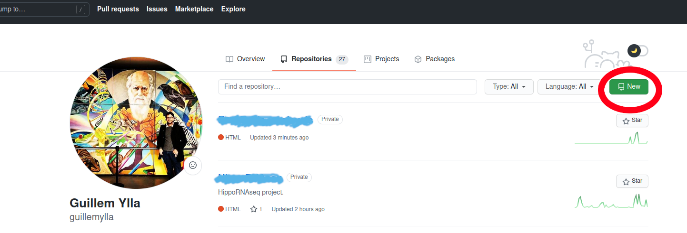

# GitHub Training

------------

- Guillem Ylla, Ph.D.
- AT4BR course, Jagiellonian University
- February 2024

------------

## Table of contents

- [Introduction](#Introduction)
- [Create a GitHub account](#Create-a-GitHub-account)
- [First time using git](#First-time-using-git)
- [Create a repository from GitHub](#Create-a-repository-from-GitHub)
- [Add files to the repository](#Add-files-to-the-repository)
- [Edit files](#Edit-files)
- [Commit changes](#Commit-changes)
- [Branching and merging](#Branching-and-merging)
- [Restoring](#Restoring)
- [Merging conflicts](#Merging-conflicts)
- [Pulling changes](#Pulling-changes)
- [Basic bash commands](#Basic-bash-commands)


----------

## Introduction

### What is git?

Git is a version-control tool that tracks changes made to the files and directories in a project.

### When do I want to use git?

Whenever you need to write more than 1 line of code (IMO).  

### Why do I want to use git?

- To help making your analysis/scripts reproducible.
- To go back to previous versions of your scripts.
- To share your code.
- To collaborate.


### What is GitHub?

A cloud-base platform to host code and version control using git. There are many other similar platforms (GitLab, Bitbucket), with similar features. Since GitHub is one of the most popular platforms and offers a basic free tier for personal use and an advanced free tier for academia in this tutorial I will use GitHub.


### How does Git work?

Git creates snapshots of all your files and directories every time you "commit". Git takes a picture of what all your files look like at that moment and stores a reference to that snapshot. For efficiency, the files that are not changed are not stored again, Git just creates a link to the previous identical stored file.

This system allows the user to go back to any previous version of the project. It also allows to create project branches that are useful for exploring new ideas, or for allowing multiple people to work on the same project at once. Branches then can be merged to the main one if the user decides to keep the changes made on the branch. 


-------

## First time using git

 1. The first time you use git in a computer, you need to configure it
 
 ```
 $ git config --global user.name "your_username"
 $ git config --global user.email youremail@example.com
 ```

2. Optional: if you want git to remember the password during a period of time.


```
git config credential.helper 'cache --timeout=<seconds>'
```

----------

## Create a repository from GitHub

1. Go to https://github.com/ and log in.
2. Go to your profile ("click on the top right icon"->"Your profile")
3. Click on "Repositories"
4. CLick on "New"



5. Choose a **name** for your repository, add a **Description** (optional) , define if it should be **public** or **private** , add a **README** file (optional), add **license** (optional).
6. "Create repository"


7. You will see the repository in your profile. If you chose to add a README, you will see it with its content (by default it will contain what you put as "Description").


8. Click on "Code" and copy the URL of your repository.
    - If you set up SSH key in your computer, use the SSH url. 
    - If you use user and token, use HTTPS.


9. Go to your computer (or the cluster, or any machine you want), open the terminal, navigate to the directory of your choice, and **clone** the repository with the command:

```
git clone https://github.com/guillemylla/GitHub_Training.git
```


At this point, you have created a repository with a README file in GitHub and downloaded it to your computer.

------------

## Add files to the repository

After cloning the new repository now you can start your project.

1. Create a python scripts with your favorite text editor (NOT word processor.  Text editors are; NotePad, TextEdit, Gedit, nano, Sublime, Atom, etc. ).
2. Start tracking the file with git.
```
git add Hello_World.py
```
 - If you want to track **all files in the directory* at once you can do:
```
git add .
```
3. Commit (create a snapshot of the file)
    * Add a message indicating that is the first commit
```
git commit -m "my first commit"
```
4. Save the changes in the cloud (GitHub)
```
git push origin main
```
 - origin is the default name Git gives to the server you cloned from:
5. Go to GitHub and you should see the [Hello_World.py](hello_world.py) file in the repository.


## Edit files

1. Let's edit the file Hello_world.py
3. See differences with last committed version.
```
git diff
```
2. Stage all modified files.
    * Git has a staging area in which it stores files with changes you want to save that haven't been saved yet. Putting files in the staging area is like putting things in a box, while committing those changes is like putting that box in the mail: you can add more things to the box or take things out as often as you want, but once you put it in the mail, you can't make further changes.
```
git add -u
```
3. If you check the status ``git status`` it will show you that the file has "changes to be committed". The snapshot has not yet been created.

    
---------

## Commit changes

1- Now, create a "snapshot" of the current files
```
git commit -m "add Spanish"
```

 * If you accidentally mistype a commit message, you can change it using the ```--amend``` flag.


```
git commit -m "add spinach"
git commit --amend -m "add Spanish"
```


2- Save changes on GitHub

```
git push
```
3- You can see the changes and compare versions in GitHub


-----------

## Branching and merging

Allows you to diverge from the main branch. The main branch reminds unhatched while you experiment in the branch.  If you are happy with the new branch, you can later make it the main one.

1- Create  new branch

```
git branch new_branch
```

2- Change working branch to the "new_branch"

```
git checkout new_branch
```

3- Edit a file (i.e. Hello_World.py))

4- Stage and commit the changes to the new branch

```
git add -u Hello_world.py
git commit -m "first commit to new branch"
git push origin new_branch
```

5- Compare the 2 branches

```
git diff main..new_branch
```

6- Go back to main branch

```
git checkout main
```

7- Merge the branch to main

```
 git merge new_branch
 git push
 ```
 * Now main branch contains the changes made on the new branch

---------------

## Restoring

1- See all the commits:
```
git log
```
2- Find the commit id we want to restore.

```
git checkout <commit ID>
```
3-Edit the file and:
```
git add -u  Hello_world.py
git commit -m "change the past"
```
4-  NO, we can't change the past (git commit gives error). But we can make a branch and commit
```
git branch back_to_the_future
git checkout  back_to_the_future
git push origin back_to_the_future
```

5- Make the recovered version the main

```
git checkout main
git merge back_to_the_future
```

*If you only want to restore a single file (i.e. Hello_world.py ):

```
git checkout <commit ID> Hello_world.py 
```

--------------

## Merging conflicts

 Typically happens When same lines have been changed independently and Git cannot automatically determine what is correct.

1- Create 2 branches

```
git branch branch_1
git branch branch_2
git branch
```
2 - Go to branch_1 and edit 1st line
```
git checkout branch_1
git ad -u Hello_world.py
git commit -m "SayHi function"
git push origin branch_1
```
2 - Go to branch_2 and edit 1st line
```
git checkout branch_2
git add -u Hello_world.py
git commit -m "Hello Bob"
git push origin branch_2
```
3- Now go back to branch_1 and try to merge it with branch_2
 ```
 git checkout  branch_1
 git diff branch_1..branch_2
 git merge branch_2
 ```
 * We get a merging conflict error
 ```
Auto-merging Hello_world.py
CONFLICT (content): Merge conflict in Hello_world.py
Automatic merge failed; fix conflicts and then commit the result.
```
4- See details
```
git log --merge
```
5- Git didn't know which version is correct, so put both of them in the "Hello_world.py" using these symbols

```
<<<<<<< HEAD
Content of latest edited branch
=======
Content of the other branch
>>>>>>> branch_1
```

6- Delete the "unwanted"" lines and commit

```
git add -u Hello_world.py
git commit -m "Fix merge"
git push origin git push 

```

7- Go to main branch and notice that it hasn't changed, lets update it with content from branch_1,

```
git checkout main
git merge branch_1
```


-----------

## Pulling changes

- Update your local files with the changes available in remote (GitHub) files.
    - Maybe your worked on the same project in 2 different computers (i.e. my desktop and cluster), or you collaborated with someone. This can result in the remote files being ahead of your local files .


1- I clone the project in a new device (in this example I clone it in another directory) that I call **Machine_2**.
```
git clone https://github.com/guillemylla/GitHub_Training.git
```
 * This Downloads all the files

2- Now I edit the files and commit the changes in **Machine_2** and push them to main branch.
```
git add -u Hello_world.py
git commit -m "add date"
git push origin main
```
3- I go back to work in the main branch of **Machine_1**, but changes made on **Machine_2** are not there. I have to pull the changes from GitHub.
```
git config --global pull.ff only  ## configigure pull behavior
git pull
```
* This will update my local version of the main branch.


### Common conflict

- When the same file in the same branch has been edited independently by different users/machines. (Not recommended, better to create different branches for each machine/user).


1- Edit, commit, and push main branch from **Machine_1**.
```
git add -u Hello_world.py 
git commitn -m "changes from machine_1"
git push
```
2- Edit, commit and push form **Machine_2** will get you an error. Because the remote main branch is ahead of you. 
```
git add -u Hello_world.py 
git commitn -m "changes from machine_2"
git push
```
 * Git is preventing you to erase the pushed changes. You can't pull either, git tries to protect your local changes.
3- Git fetch will download the info from GitHub without performing any changes to your local files
```
git fetch
git merge origin main
```
4- We now can see and solve the merging conflicts as before
5- Commit and push changes
```
git add -u Hello_world.py 
git commit -m "resolve merge machine1 and machine2"
```


-----------


## Basic Git commands

- ```git clone```: Clones a remote repository to your local machine.
- ```git init```: Initialize repository.
- ```git status```: Shows modified and staged files.
- ```git add```: Select files that will be committed.
- ```git commit```: Creates a "snapshot" of your files.
- ```git push```: Send committed files to remote server (i.e. GitHub).
- ```git branch```: Create new branch.
- ```git checkout```: Changes working branch.
- ```git merge```: Merges content of different branches.
- ```git pull```: Downloads from remote and merges with local
- ```git fetch```: Downloads info from remote, but does not merge with local.
- ```git show```: Shows the contents of a single commit.

More details in the Git commands [CheatSheet](https://education.github.com/git-cheat-sheet-education.pdf).

------------

## Basic bash commands

Bash is a command language for Unix shell (which means that are the same for MacOs and Linux, and different from Windows which uses DOS). 

The Bash commands that appear in this tutorial are:

- ```cd```: change directory 
- ```mv```: move
- ```cp```: copy
- ```nano```: Command line text editor (there are others such as vim, emacs)

------------

## Other things

- Host your websites
- Share posters (i.e. a QR code on your poster that redirects to the PDF hosted on github )

------------

## Resources
- http://book.git-scm.com/book/en/v2
- https://ufresearchcomputing.github.io/git-training/
- https://git-scm.com/book/en/v2/Getting-Started-Installing-Git
- https://education.github.com/git-cheat-sheet-education.pdf


----------


